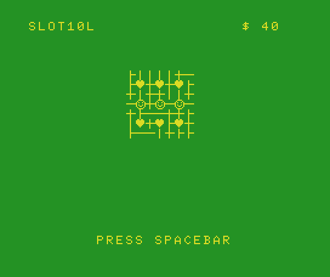

# SLOT10L
SLOT10L is a simple slot machine simulator in 10 lines of MSX2 BASIC v3.



I made this game for the pleasure of participating in a GameJam competition. 

For other commitments I set myself a limit of 90 minutes to complete the project - the time of a boring football match of Euro 2020.

MSX was not the platform of my childhood - I only owned Commodore computers - but it was a mature choice: I think it has the best version of BASIC among 8-bit machines.

# Game Logic
Player presses spacebar to start spin. 
Each spin costs 1$ and if 3 symbols are on the same horizontal line the user wins 10$.

# Controls
- SPACEBAR to spin

Sources are stored at: https://github.com/robertocapuano/Slot10L

# Installation
Game was developed in MSX-BASIC v3 on a MSX2. Emulator is available at https://webmsx.org/
1. connect to https://webmsx.org/
2. press ALT+B
3. copy and paste source code
5. type in:
```
run
```

WebMSX Launch URL:
- https://webmsx.org?MACHINE=MSX2P&DISK=https://raw.githubusercontent.com/robertocapuano/Slot10L/main/slot.dsk


# Source Description

```
0 SCREEN1,0,0:COLOR10,12,12:KEYOFF:DEFINTA-Z:B=6349:Z=RND(-TIME):M=10
```
Line 0 initialise screen mode, colors. Defines integers variables.
Initialise random number generator. Define varibale B that contains base video memory address.
Variable M contains user money value.


```
1 dimSP(2,15):forI=0to15:A=RND(1)*3:forJ=0to2:SP(J,I)=A:nextJ,I:CLS:
```
SP array contains the symbols of the 3 wheels. And it's initialised by random values.

```
2 ?"SLOT10L":forI=0to6:forJ=0to6:vpoke6316+j+i*32,RND(1)*4+20:nextJ,I
```
Print game title. Render some random graphics.

```
3 forJ=0to2:forI=0to2:A=SP(J,(ST(J)+I)mod16)+1:vpokeB+64*I+J*2,A
```
Render wheels symbols on screen.

```
4 R(J,I)=A:nextI,J:LOCATE7,22:?"PRESS SPACEBAR":LOCATE22,0
```
R array contains actual screen symbol, in order to reduce code after.

```
5 ?"$";M;"  ":CH=0:forJ=0to2:CK=(SR(J)>0):CH=CH+CK:SR(J)=SR(J)-1:
```
Print money value. CH contains the number of steps for each wheel.

```
6 ST(J)=(ST(J)-CK*1)mod15:next:if CH<>0then:play"T120O4L15A":goto3
```
For each spin step a sound is played.

```
7 forK=0to2:ifR(0,K)=R(1,K)andR(1,K)=R(2,K)thenM=M+10:play"T120O4L60B"
```
Checks if 3 symbols are in the same line.
In case of victory money value (M) is increased a sound is played.
```
8 nextK:LOCATE22,0:?"$";M;"  ":LOCATE22,0:S$=" ":
```
Updated money value is rendered
```
9K$=INKEY$:IFK$<>S$then9:elseM=M-1:forJ=0to2:SR(J)=RND(1)*15:nextJ:goto5
```
Read the user input. A random value for each wheel step is generated.
